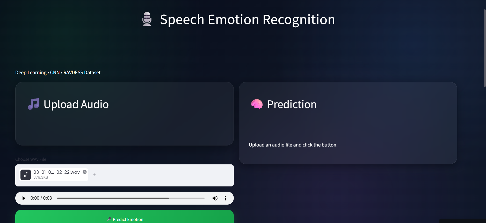
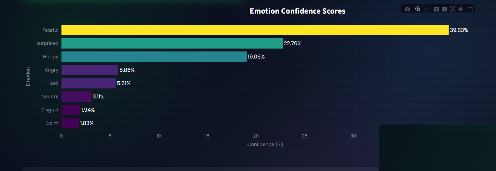
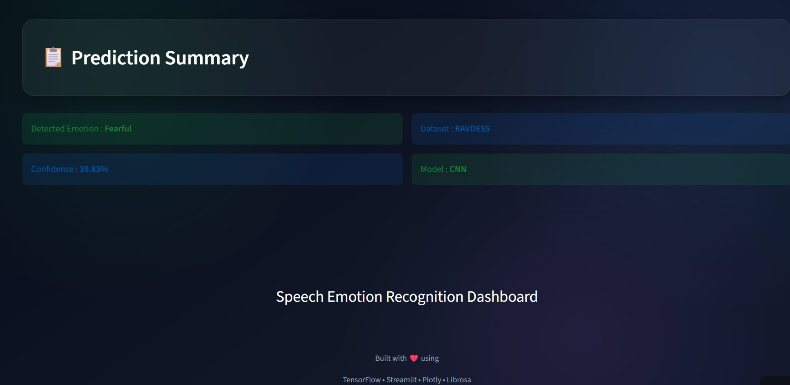

# 🎙️ Emotion Recognition from Speech

A Deep Learning-based Speech Emotion Recognition system that predicts human emotions from speech audio. The application uses TensorFlow/Keras for model prediction and Streamlit for an interactive web interface.

## 🌐 Live Demo

**Streamlit App:**  
https://codealphaemotionrecognitionfromspeech-e3gjvsrhre5yueywnzcn66.streamlit.app/

---

## 📌 Features

- Upload `.wav` audio files
- Predict human emotions from speech
- Displays predicted emotion with confidence score
- Interactive and user-friendly Streamlit interface
- Deep Learning-based prediction using TensorFlow/Keras

---

## 🛠️ Tech Stack

- Python
- TensorFlow / Keras
- Streamlit
- Librosa
- NumPy
- Pandas
- Scikit-learn
- Joblib

---


## 📊 Dataset

The model is trained on a Speech Emotion Recognition dataset containing emotions such as:

- Angry
- Happy
- Sad
- Fear
- Neutral
- Disgust
- Surprise
- Calm

---

## 🧠 Model

- Deep Learning (CNN)
- MFCC Feature Extraction
- TensorFlow/Keras
- Speech Emotion Classification

---

## 📸 Application Preview

### Home Page



### Audio Upload



### Prediction Result



---

## ⚙️ Installation

### Clone the repository

```bash
git clone https://github.com/sakshtapatil/CODEALPHA_EmotionRecognitionFromSpeech.git
```

### Navigate to the project folder

```bash
cd CODEALPHA_EmotionRecognitionFromSpeech
```

### Install dependencies

```bash
pip install -r requirements.txt
```

### Run the application

```bash
streamlit run app.py
```

---

## 🚀 Future Improvements

- Support multiple audio formats
- Improve model accuracy
- Real-time microphone emotion detection
- Display emotion probability graph

---

## 👩‍💻 Author

**Sakshta Patil**

GitHub: https://github.com/sakshtapatil

---

